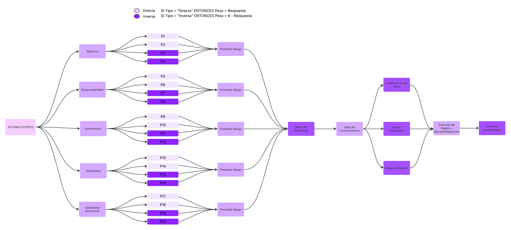

# Sistema Experto para el Perfil de Personalidad

Sistema experto desarrollado en **Python** para identificar el perfil de personalidad de un usuario mediante un cuestionario basado en cinco rasgos de personalidad. El sistema utiliza un motor de inferencia basado en reglas para determinar el rasgo dominante, el nivel obtenido y generar recomendaciones de autoconocimiento.

---

# Objetivo

Desarrollar un sistema experto capaz de analizar las respuestas de un cuestionario, aplicar reglas de inferencia y proporcionar un perfil de personalidad junto con recomendaciones orientadas al autoconocimiento.

---

# Características

- Cuestionario de 20 preguntas.
- Escala de Likert de 1 a 5.
- Manejo de preguntas directas e inversas.
- Cálculo automático de promedios por rasgo.
- Clasificación por niveles (Bajo, Medio y Alto).
- Identificación del rasgo dominante.
- Identificación del rasgo con mayor oportunidad de mejora.
- Generación automática del perfil de personalidad.
- Recomendaciones personalizadas.

---

# Arquitectura del sistema




---

# Flujo del sistema

1. El usuario responde las 20 preguntas.
2. Las respuestas son normalizadas según el tipo de pregunta (Directa o Inversa).
3. Se calcula el promedio de cada rasgo.
4. El motor de inferencia aplica las reglas definidas.
5. El motor consulta la base de conocimiento.
6. Se determina:
   - Nivel del rasgo.
   - Rasgo dominante.
   - Rasgo a mejorar.
7. Se consulta la información de perfiles y recomendaciones.
8. Se genera el reporte final.

---

# Motor de Inferencia

El motor de inferencia analiza los promedios obtenidos y aplica las reglas del sistema experto.

Las reglas implementadas son:

- Conversión de preguntas inversas mediante:

```
Peso = 6 - Respuesta
```

- Clasificación del nivel:

| Promedio | Nivel |
|----------|-------|
|1.00 - 2.49|Bajo|
|2.50 - 3.99|Medio|
|4.00 - 5.00|Alto|

- Rasgo dominante:

Se selecciona el rasgo con el promedio más alto.

- Rasgo a mejorar:

Se selecciona el rasgo con el promedio más bajo.

En caso de empate, el sistema conserva el primer rasgo encontrado según el orden establecido en la base de conocimiento.

---

# Base de Conocimiento

La base de conocimiento está conformada por:

- Rasgos
- Preguntas
- Escala de Likert
- Niveles
- Perfiles
- Recomendaciones

Toda esta información se encuentra separada del motor de inferencia para facilitar el mantenimiento del sistema.

---

# Estructura del proyecto

```
src
│
├── conocimiento
│   ├── preguntas.py
│   ├── rasgos.py
│   ├── niveles.py
│   ├── perfiles.py
│   └── recomendaciones.py
│
├── inferencia
│   ├── reglas.py
│   └── motor.py
│
├── servicios
│   ├── cuestionario.py
│   └── reporte.py
│
└── main.py
```

---

# Tecnologías utilizadas

- Python 3
- Visual Studio Code
- Git
- GitHub

---

# Autor

Proyecto desarrollado por:

**Yenifer Yurley Cortez Montañez**
